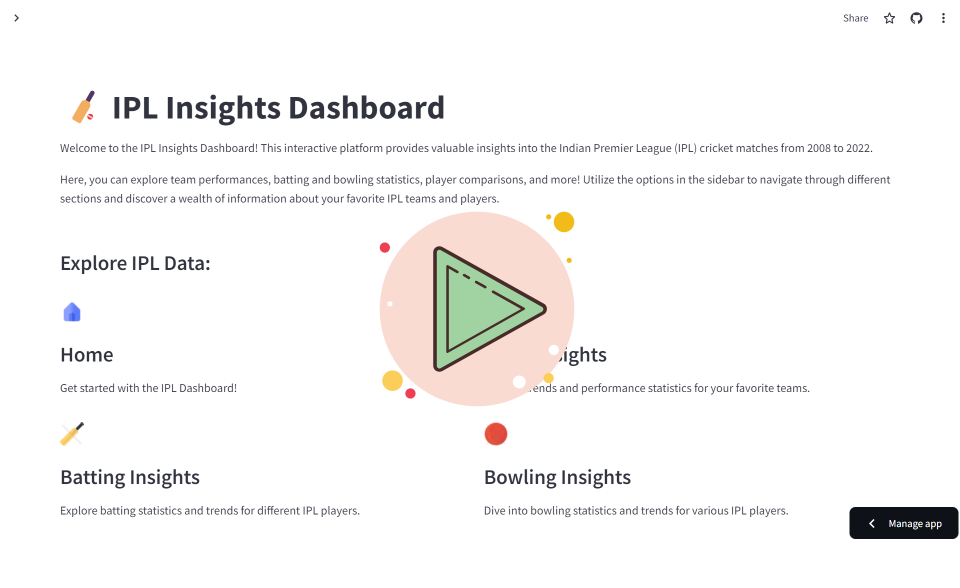

# IPL Insights Dashboard 🏏

Welcome to the **IPL Insights Dashboard** repository! This project offers an interactive dashboard for analyzing Indian Premier League (IPL) cricket data from 2008 to 2022. The dashboard is built using Streamlit and Plotly, providing insights into team, batting, and bowling performances, as well as player comparisons. [live ✨](https://fireindex-ipl-dashboard.streamlit.app/)

For a brief overview of the IPL Insights Dashboard, watch the following video:

[](https://player.vimeo.com/video/939100644?badge=0&autopause=0&player_id=0&app_id=58479)

## Table of Contents

- [Overview](#overview)
- [Features](#features)
- [Installation](#installation)
- [Usage](#usage)
- [Components](#components)
- [API](#api)
- [Data Sources](#data-sources)
- [Contributing](#contributing)
- [License](#license)

## Overview

The IPL Insights Dashboard leverages data from IPL matches to provide a comprehensive analysis of different aspects of the league. Whether you're interested in team performance trends, player comparisons, or specific batting and bowling statistics, this dashboard has you covered. The interactive visualizations make it easy to explore and understand the data, enabling cricket enthusiasts to gain valuable insights into the IPL.

## Features

- **Home Section**: Overview of the IPL Insights Dashboard.
- **Team Insights**: Analyze team performance trends across different seasons.
- **Batting Insights**: Explore batting statistics and trends for IPL players.
- **Bowling Insights**: Dive into bowling statistics and trends for IPL players.
- **Player vs Player**: Compare performances of two different players.
- **Interactive Visualizations**: Create various types of charts such as bar, line, scatter, strip, histogram, pie, and sunburst to visualize data.

## Installation

To use the IPL Insights Dashboard locally, follow these steps:

1. Clone this repository:
   ```bash
   git clone https://github.com/FireIndex/1_DataScience_Project--IPL_Streamlit_Dashboard.git
   ```
2. Navigate to the project directory:
   ```bash
   cd 1_DataScience_Project--IPL_Streamlit_Dashboard
   ```
3. Set up a virtual environment (optional but recommended):
   ```bash
   python -m venv venv
   source venv/bin/activate  # On Windows, use: venv\Scripts\activate
   ```
4. Install the required dependencies:
   ```bash
   pip install -r requirements.txt
   ```
5. Run the dashboard:
   ```bash
   streamlit run app.py
   ```

## Usage

After running the dashboard, it will open in your default web browser. Use the sidebar to navigate through different sections and explore various insights:

- Navigate through the options on the sidebar to explore different areas.
- Select specific seasons, teams, or players to analyze data.
- Choose from various types of charts to visualize data based on your selections.

## Components

- **`IPL` Class**: Handles data loading and processing.
- **`IPLDashboard` Class**: Manages the dashboard interface, including setting up the sidebar and rendering different sections.
- **Rendering Methods**: Functions that render specific insights such as team, batting, bowling, and player comparisons.
- **`app.py`**: Main script to run the Streamlit dashboard.

## API

The dashboard leverages the IPL class to interact with IPL data. For more information understand the class methods and API usage.

## Data Sources

The data used in this project is sourced from publicly available IPL datasets:

- [IPL Matches (2008-2022)](https://docs.google.com/spreadsheets/d/e/2PACX-1vRy2DUdUbaKx_Co9F0FSnIlyS-8kp4aKv_I0-qzNeghiZHAI_hw94gKG22XTxNJHMFnFVKsO4xWOdIs/pub?gid=1655759976&single=true&output=csv)
- [IPL Ball by Ball (2008-2022)](https://docs.google.com/spreadsheets/d/e/2PACX-1vRu6cb6Pj8C9elJc5ubswjVTObommsITlNsFy5X0EiBY7S-lsHEUqx3g_M16r50Ytjc0XQCdGDyzE_Y/pub?output=csv)

## Contributing

We welcome contributions to the IPL Insights Dashboard! Please feel free to submit pull requests or report any issues on the [GitHub repository](https://github.com/FireIndex/1_DataScience_Project--IPL_Streamlit_Dashboard).

Contributions are welcome! To contribute:

1. Fork the repository.
2. Create a new branch:
   ```bash
   git checkout -b feature/your-feature
   ```
3. Commit your changes:
   ```bash
   git commit -m "Add your commit message"
   ```
4. Push the branch:
   ```bash
   git push origin feature/your-feature
   ```
5. Submit a pull request.

## License

This project is licensed under the [MIT License](LICENSE). You are free to use, modify, and distribute the code as per the license terms.

---

[](https://twitter.com/FireIndex__)
[](https://github.com/FireIndex/Data-Science)
[](https://github.com/FireIndex/Data-Science)
